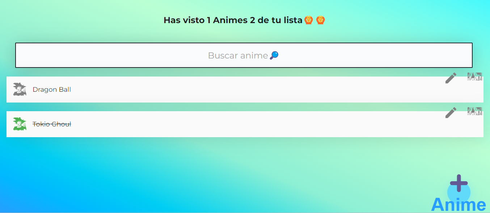

# Lista de Animes

Una aplicación web simple para gestionar una lista de animes. Permite a los usuarios agregar nuevos animes, marcarlos como vistos, editar la información y eliminarlos de la lista.

## Características

- **Agregar Anime:** Los usuarios pueden agregar nuevos animes a la lista ingresando el título y la descripción.
- **Marcar como Visto:** Los usuarios pueden marcar los animes como vistos, lo que los tachara dentro de la lista.
- **Editar Información:** Los usuarios pueden editar la información de un anime existente, incluido el título y la descripción.
- **Eliminar Anime:** Los usuarios pueden eliminar un anime de la lista.

## Tecnologías Utilizadas

- HTML
- CSS
- JavaScript

## Capturas de Pantalla 📷📷

- Página principal.

- Agregar Anime a la lista

## Instrucciones de Uso

1. Clona este repositorio en tu máquina local.
2. Abre el archivo `index.html` en tu navegador web.
3. Para agregar un anime, haz clic en el botón "Agregar Anime" y completa el formulario.
4. Para marcar un anime como visto, haz clic en el botón "Marcar como Visto" junto al anime correspondiente.
5. Para editar la información de un anime, haz clic en el botón "Editar" y modifica los campos.
6. Para eliminar un anime, haz clic en el botón "Eliminar" junto al anime correspondiente.

## Contribuciones

¡Las contribuciones son bienvenidas! Si deseas contribuir a este proyecto, sigue estos pasos:

1. Haz un fork del repositorio.
2. Crea una nueva rama (`git checkout -b feature/nueva-funcionalidad`).
3. Haz tus cambios y haz commit de ellos (`git commit -am 'Agrega nueva funcionalidad'`).
4. Haz push de la rama (`git push origin feature/nueva-funcionalidad`).
5. Crea un nuevo pull request.

## Licencia

Este proyecto está bajo la Licencia MIT. Consulta el archivo `LICENSE` para obtener más detalles.
